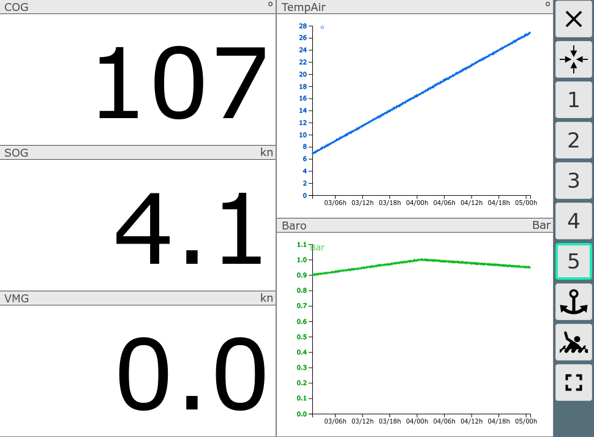
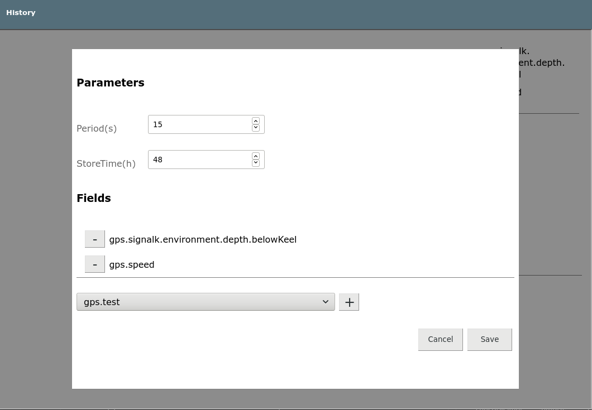

AvNav History Plugin
===========================

This project provides a plugin for [AvNav](https://www.wellenvogel.net/software/avnav/docs/beschreibung.html?lang=en) 
collecting the history of selected data and provides a UI for displaying it in a diagram.

The project is based on ideas from a discussion in the (german) [Segeln Forum](https://www.segeln-forum.de/board194-boot-technik/board35-elektrik-und-elektronik/board195-open-boat-projects-org/p2243721-arduino-nmea0183-barometer/#post2243721).

Basically this software uses the [AvNav Plugin Interface](https://www.wellenvogel.net/software/avnav/docs/hints/plugins.html?lang=en)
to listen for incoming NMEA records. It parses NMEA [XDR](https://gpsd.gitlab.io/gpsd/NMEA.html#_xdr_transducer_measurement) records
and stores the data from selected transducers in files in the AvNav data directory. You can configure the keys to store, 
as well as storage frequency and the time to preserve the data.
Additionally you can select items from the internal data store in AvNav (see [plugin api, interface C](https://www.wellenvogel.net/software/avnav/docs/hints/plugins.html?lang=en#h2:pluginpy)) 
that you would like to record. 

License: [MIT](LICENSE.md)




Installation
------------
You can use the plugin in 2 different ways.
1.  Download the source code as a zip and unpack it into a directory /home/pi/avnav/data/plugins/history.
    If the directory does not exist just create it. On an normal linux system (not raspberry pi) the directory will be /home/(user)/avnav/plugins/history.
    In this case the name of the plugin will be user-history. So you can modify the files and adapt them to your needs.

1.  Download the package provided in the releases section or build your own package using buildPackage.sh (requires a linux machine with docker installed). Install the package using the command
    ```
    sudo dpkg -i avnav-history-plugin...._all.deb
    ```

User App
--------
The plugin registers a [User App](https://www.wellenvogel.net/software/avnav/docs/userdoc/addonconfigpage.html?lang=en#h1:ConfigurationofUserApps)
that provides a simple graphical display of the collected data using [d3.js](https://d3js.org/) - see screenshot.
You can select the values to be displayed and the number of past hours to be included. Option 'dot' will plot datapoints
as stored, 'line' will draw a line linking all datapoints. Y-axis minimum and maximum values may limit the y-axis to fixed boundaries. 
If left blank (default) y-axis will be scaled automatically by the extremes of the data collected.
Using the edit button you can configure the plugin.
Additionally you can select the formatter to be applied to the values.
A tooltip displays the current datapoint's value when hovering/clicking near a curve.
The implementation consists of some [html code](index.html) and java script code in [index.js](index.js) and 
[historychart.js](historychart.js). 

Configuration (Server)
-------------
Starting with avnav 20210322 the configuration is included in AvNav and the plugin UI. Just use the edit button from within the plugin UI.



You need to configure the values to be stored, the frequency (period) and the store time.
To select values pick from list of all currently available keys in AvNav's internal Store (so ensure that the values to inlcude are currently available).
Transducer values from XDR records will be visible as gps.transducers.xxxx.
The example configuration defines the values to be written every 60s to the history and kept for up to 72h hours. 
Data received within the 60s period are accumulated and the average is stored.
Data are retrieved from the internal store at 1/10 of the configured period - values being accumulated again.


Widget
------
The plugin provides the [HistoryWidget](plugin.js).
This widget can be used to display the graphs of selected historical data. You can choose the field you would like to display, the color, the time frame, 
the yaxis limits and the formatter to be applied. 

Formatter
---------
To display values and charts in a proper unit there are a couple of formatters to choose from. 
To add other formatters you can enter code into your [user.js](https://www.wellenvogel.net/software/avnav/docs/hints/userjs.html?lang=en)
```
    let pn="avnavHistoryPlugin";
    if (! window[pn]) window[pn]={};
    if (! window[pn].HistoryFormatter) window[pn].HistoryFormatter={};
    let formatters=window[pn].HistoryFormatter;
    formatters.bar={unit:'Bar',f:function(v){return v/100000} };
``` 
This example adds a formatter to display Pressure in Bar. You need to check/create the appropriate Objects starting from the window level:
`window.avnavHistoryPlugin.HistoryFormatter`.
Once you have added a formatter this way it can be used both for the UserApp and for the Widget.

Implementation Details
----------------------

Server
______

The [python part](plugin.py) reads the configuration and registers itself for HTTP API requests.
It reads the available history files (starting at the configured storeTime backwards).
It starts listening for NMEA Data (XDR only) and if configured it reads the data from the internal store.
Whenever some data is received within a period, the data is written to the files.
The files are simple text files (ending with .avh, one file per day). Internally they look like:
```
H,1609673613.8,Barometer,TempAir,gps.windSpeed
D,1609545600,998.849953953,24.9590731069,14.8507830083
...
```
Whenever the file is opened or AvNav is restarted a header line (starting with H) is written containing the current field names that will be collected.
After every period with data a "D" line is written holding timestamp and the comma separated data values.
When the files are read during start up the plugin compares the field names in the file with its configured names and reads 
just the matching fields. This way you can easily change the data that you collect without losing old data.
  
The plugin spawns its own thread to do some housekeeping by deleting the oldest entries internally (older then storeTime hours).
It will also remove old files that will not be used any more.
 
In the method handleApiRequest the communication with the User App is handled. There are 2 requests:

request | function
--------|---------
..../api/status | return a json object with status=OK,field names, number of records, period, storeTime, oldest
..../api/histoy | returns a json object with fields, period and data - an array with the values. you can provide a fields parameter and fromTime,toTime
      
Java Script
___________

The java script part consists of [historychart.js](historychart.js) that is both used by the user app and the widget.
It contains a function HistoryChart which you can instantiate to create charts.
The user app GUI is located in [index.js](index.js).
The widget implementation is located in [plugin.js](plugin.js). It uses some trick do deal with the way AvNav is creating 
it's HTML (DOM). Therefore in has a renderCanvas function that is simply used as it is called when the DOM is ready 
(but there is no drawing to this canvas).              

Package Building
----------------
For a simple package building [NFPM](https://nfpm.goreleaser.com/) is used and started in a docker container (use [buildPkg.sh](buildPkg.sh)). In the [package.yaml](package.yaml) the properties of the packge can be set. 

Additionally a [GitHub workflow](.github/workflows/createPackage.yml) has been set up to create a release and build a package whenever you push to the release branch.
So when you fork this repository you can create a package even without a local environment.
To trigger a package build at GitHub after forking just create a release branch and push this.
