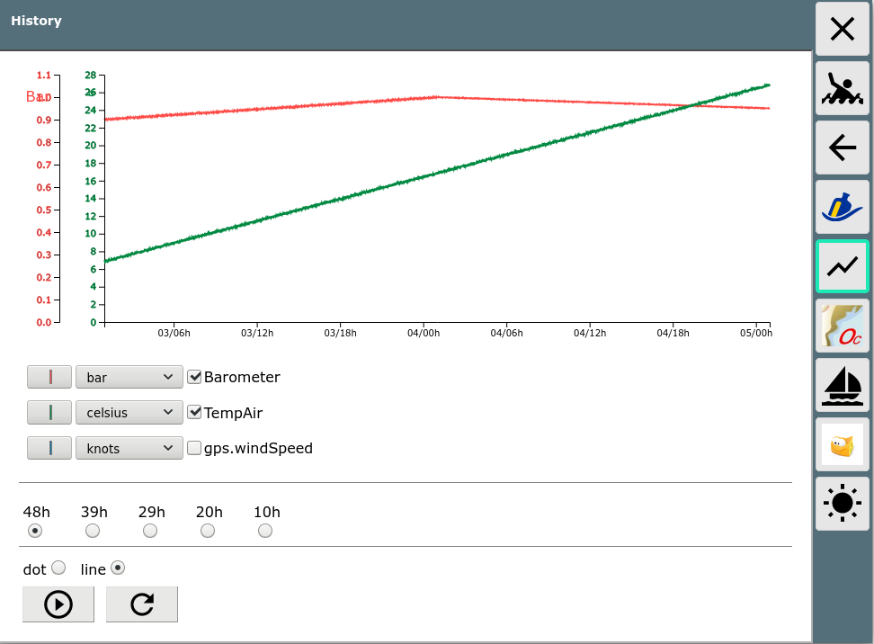

AvNav History Plugin
===========================

This project provides a plugin for [AvNav](https://www.wellenvogel.net/software/avnav/docs/beschreibung.html?lang=en) that collects the history of selected data and provides a UI for displaying them in a diagram.

The project is based on ideas from a discussion in the (german) [Segeln Forum](https://www.segeln-forum.de/board194-boot-technik/board35-elektrik-und-elektronik/board195-open-boat-projects-org/p2243721-arduino-nmea0183-barometer/#post2243721).

Basically this software uses the [AvNav Plugin Interface](https://www.wellenvogel.net/software/avnav/docs/hints/plugins.html?lang=en)
to listen for incoming NMEA records. It parses NMEA [XDR](https://gpsd.gitlab.io/gpsd/NMEA.html#_xdr_transducer_measurement) records
and stores the data from selected transducers in files in the AvNav data directory. You can configure the names you would like to store, 
the storage interval and the time you would like to keep the data.
Additionally you can select items from the internal data store in AvNav (see [plugin api, interface C](https://www.wellenvogel.net/software/avnav/docs/hints/plugins.html?lang=en#h2:pluginpy)) 
that you would like to record. 

License: [MIT](LICENSE.md)



Installation
------------
You can use the plugin in 2 different ways.
1.  Download the source code as a zip and unpack it into a directory /home/pi/avnav/data/plugins/history.
    In this case the name of the plugin will be user-setalk-remote. You can change the files and adapt it to your needs.

1.  Download the package provided in the releases section or build your own package using buildPackage.sh (requires a linux machine with docker installed). Install the package using the command
    ```
    sudo dpkg -i avnav-history-plugin...._all.deb
    ```

Configuration
-------------
You need to configure the the values you would like to store, the interval and the store time.
```
<AVNPluginHandler>
  <user-history sensorNames="Barometer,TempAir" storeKeys="gps.windSpeed" period="30"/>
</AVNPluginHandler>
```
Just consider that typically there will be some other entries below the AVNPluginHandler already - just take care to only have one AVNPluginHandler.
In the example the plugin was downloaded as zip and installed into /home/pi/avnav/data/plugins/history.
I configured the Transducer values Barometer and TempAir to be recorded from XDR NMEA messages and the value gps.windSpeed from the internal store.
With this configuration the values are written every 30s to the history and kept for at most 48h hours. 
Data being received within the 30s interval is accumulated and the average is stored.
The fetching from the internal store will be done at 1/10 of the configured interval - values being accumulated again.
If you installed the package you would need to use
```
<AVNPluginHandler>
  <system-history sensorNames="Barometer,TempAir" storeKeys="gps.windSpeed" period="30" storeTime="48"/>
</AVNPluginHandler>
```

The following items can be configured:

Name | Default | Description
-----|---------|----------
sensorNames | -empty- | comma separated transducer names from [XDR](https://gpsd.gitlab.io/gpsd/NMEA.html#_xdr_transducer_measurement) records you would like to store
storeKeys | -empty- | keys from the AvNav internal store. You can get a list from the [Layout Editor](https://www.wellenvogel.net/software/avnav/docs/hints/layouts.html?lang=en#h2:LayoutEditor) - just omitting the "nav."
period | 30 | storage interval in seconds
storeTime | 48 | time (in hours) to keep the data
enabled | true | if set to false the plugin is disabled
pollingInterval | 1/10 of period | if set this is the interval used to poll the internal data for values configured with storeKeys

You must at least configure one sensorName or one storeKey - otherwise the plugin will simply stop.

User App
--------
The plugin registers a [User App](https://www.wellenvogel.net/software/avnav/docs/userdoc/addonconfigpage.html?lang=en#h1:ConfigurationofUserApps)
that provides a simple graphical display of the collected data using [d3.js](https://d3js.org/) - see screenshot.
You can select the values to be displayed and that number of hours backwards from now you would like to see.
The implementation is some [html](index.html) and mainly a [bit of js code](index.js). 

Implementation Details
----------------------

The [python part](plugin.py) reads the configuration, and registers itself for HTTP API requests.
It reads the available history files (starting at the configured storeTime backwards).
It starts listening for NMEA Data (XDR only) and if configured it reads the data from the internal store.
Whenever some data is received within a period, the data is written to the files.
The files are simple text files (anding with .avh, one file per day). Internally they look like:
```
H,1609673613.8,Barometer,TempAir,gps.windSpeed
D,1609545600,998.849953953,24.9590731069,14.8507830083
...
```
Whenever the file is opened or AvNav is restarted a header line (starting with H) is written that contains the current field names that will be collected.
After every period with data a "D" line is written that has a timestamp and the data values.
The the files are read during start up the plugin compares the field names in the file with its configured names and reads 
just the macthing fields. This way you can easily change the data that you collect without loosing old data.
  
The plugin spawns an own thread that is doing some housekeeping by deleting the oldest entries internally (older then storeTime hours).
It will also remove old files that will not be used any more.
 
In the method handleApiRequest the communication with the User App is handled. There are 2 requests:

request | function
--------|---------
..../api/status | return a json object with status=OK,field names, number of records, period, storeTime, oldest
..../api/histoy | returns a json object with fields, period and data - an array with the values. you can provide a fields parameter and fromTime,toTime
              

Package Building
----------------
For a simple package building [NFPM](https://nfpm.goreleaser.com/) is used and started in a docker container (use [buildPkg.sh](buildPkg.sh)). In the [package.yaml](package.yaml) the properties of the packge can be set. 

Additionally a [GitHub workflow](.github/workflows/createPackage.yml) has been set up to create a release and build a package whenever you push to the release branch.
So when you fork this repository you can create a package even without a local environment.